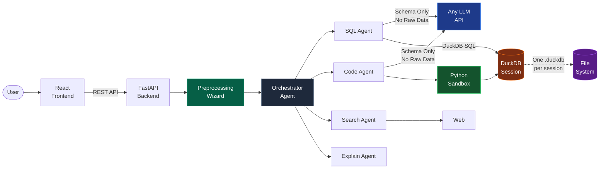
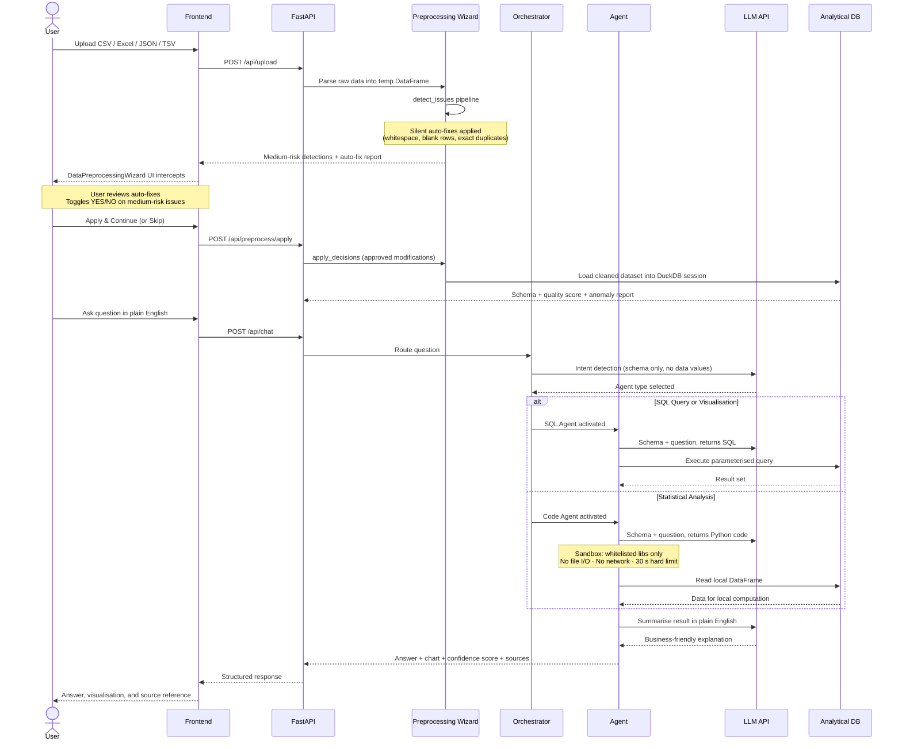

# Multi Agent Conversational AI that Keeps your data safe and secure

**NatWest Code for Purpose Hackathon 2026 | Talk to Data**

The system enables any user to ask questions about their data in plain English and receive clear, verifiable answers in seconds. No SQL, no dashboards, no data team required. Upload a dataset, ask a question, and get an answer backed by a source reference, a confidence score, and a chart where applicable.

The system is built on three pillars from the NatWest problem statement: **Clarity** (answers non-experts can act on immediately), **Trust** (every response cites its data source and carries a reliability rating), and **Speed** (a multi-agent pipeline routes each question to the right tool automatically, with no manual steps required).

---

## System Architecture

### High-Level Design (HLD)


### Request Flow (LLD - Sequence Diagram)



---

## Demo Video

https://github.com/user-attachments/assets/936c42e9-4a5b-4fc3-8b03-3b8ef8cbb8db

---

## Multi-Table Analysis (New)

Upload multiple datasets into a single session and ask questions that span them.

**How it works:**
- Click the upload button to add a file. Each goes through the preprocessing wizard as a popup.
- Files are registered as named tables (e.g. `customers.csv` becomes table `customers`).
- Ask cross-dataset questions in plain English. The AI generates JOIN queries automatically.

**Example:**
> "What is the total revenue by customer region?"
> → `SELECT c.region, SUM(o.total_amount) FROM orders o JOIN customers c ON o.customer_id = c.customer_id GROUP BY c.region`

**Sidebar:** Shows each table with its own schema, data quality score, and column list.

**PDF Report:** Includes schema + preprocessing summary for every uploaded dataset.

---

## Data Preprocessing & Quality Wizard

The Data Preprocessing system is a simple, guided data-cleaning step that fits right into the upload process. It helps make sure your data is clean, well-structured, and ready for analysis, without changing anything you don't want it to.

### Three-Phase Pipeline

**Phase 1: Detection & Auto-fixes (`POST /api/upload`)**

When the user uploads a file, the backend parses it into a temporary Pandas DataFrame and runs the `detect_issues` pipeline, producing two categories of output:

- **Silent Auto-fixes (Zero Risk):** Safe transformations applied immediately, such as stripping whitespace, removing fully blank rows, and dropping exact duplicates.
- **Medium-Risk Detections:** Ambiguous issues flagged for user review, such as parsing currency symbols into numbers, standardising mixed date formats, and replacing nulls using median estimation.

The DataFrame is cached in temporary memory mapped to a `session_id`. No database is created at this stage.

**Phase 2: User Validation (`DataPreprocessingWizard.jsx`)**

A minimalist, interactive UI intercepts the loading funnel and presents the user with a full report of the auto-fixes already applied. For every medium-risk issue detected, the user sees a YES/NO toggle with a concrete data example for context. The user can either **Apply & Continue** with their chosen rules, or **Skip** to retain the raw dataset entirely.

**Phase 3: Database Serialisation (`POST /api/preprocess/apply`)**

The backend consumes the approved decisions, applies them via `apply_decisions`, and loads the cleaned dataset into the persistent DuckDB session. AI parameters like `schema`, `anomalies`, and `data_quality` are computed exclusively on this cleaned dataset.

### Preprocessing Flow

```
User uploads file
      |
      v
Pandas temp DataFrame (in-memory, no DB yet)
      |
      v
detect_issues pipeline
      |
      +---> Silent auto-fixes applied immediately
      |
      +---> Medium-risk issues → DataPreprocessingWizard UI
                  |
                  v
         User toggles YES/NO per issue
                  |
                  v
         POST /api/preprocess/apply
                  |
                  v
         apply_decisions → cleaned DataFrame
                  |
                  v
         Loaded into DuckDB session
                  |
                  v
         Schema + quality score + anomaly report
         computed on clean data only
```

### Extensibility

The engine uses a modular, class-based pipeline (`preprocessor.py`). Adding a new data cleaning rule requires only defining a class that inherits `PreprocessStep` with a `detect()` condition and an `apply()` execution body. No changes to the core pipeline are needed.

### PDF Export Integration

All data transformations, both zero-risk auto-fixes and user-approved decisions, are automatically forwarded through the chat `system` payload in `useChat.js`. When a PDF export is requested, `pdf_generator.py` parses this history to embed a chronological **"Applied Data Preprocessing" audit table** in the report, documenting exactly how the dataset was mutated before analysis began.

---

## Security by Design

DataTalk treats data privacy as a hard architectural constraint, not a configuration option. The LLM has no access to your actual data at any stage. Security is enforced through five independent layers, each operating without relying on any other:

**Layer 1: Schema-only LLM prompting**
Agents send the LLM only column names and data types. The LLM returns SQL or Python targeting that schema. Query execution happens entirely on the local server. The LLM never receives a single data value.

**Layer 2: Python sandbox with hard boundaries**
Statistical analysis requires code execution, which carries inherent risk in most systems. Every piece of LLM-generated Python runs inside a restricted interpreter with a fixed import whitelist: `pandas`, `numpy`, `matplotlib`, `seaborn`, `scipy`, `sklearn`. The `open()` builtin is removed. OS, socket, and subprocess modules are inaccessible at the interpreter level. A 30-second thread-based timeout terminates any runaway or malicious execution. No data can leave the machine through generated code.

**Layer 3: Session isolation**
Every file upload is assigned a UUID. Each session maintains its own database file, its own in-memory cache, and its own connection object. No session can read, query, or infer data from another session.

**Layer 4: Sensitive column masking**
Users can flag individual columns as sensitive before querying. When a flagged column appears in a result, the Explain Agent is bypassed entirely. No LLM processes values from those columns, even indirectly.

**Layer 5: Input validation and query safety**
Accepted file extensions: `.csv`, `.xlsx`, `.xls`, `.json`, `.tsv`. Maximum upload size: 50 MB. Column names are normalised on ingest. All database queries use identifier quoting and parameterisation to prevent injection.

```
Data boundary, enforced at every step:

  User uploads file
        |
        v
  Preprocessing Wizard (local, in-memory only)
        |
        v
  Analytical DB (local server, cleaned data)
        |
        v
  Schema extracted (names + types only)
        |
        v
  Sent to LLM
        |
  Raw data stops here, always
```

---

## How DataTalk Compares

Most natural language data tools send your data to a remote model to generate answers. DataTalk inverts this: the intelligence comes to your data, not the other way around.

| Dimension | Standard NL-to-Data Tools | DataTalk |
|---|---|---|
| Data sent to LLM | Full rows and values | Schema only, no data values ever |
| Analysis depth | SQL aggregations only | SQL plus sandboxed Python: stats, ML, custom charts |
| LLM provider | Vendor-locked to one API | Any provider, swapped via one line in `.env` |
| Sensitive data handling | No mechanism exists | Column-level masking with automatic agent bypass |
| Code execution safety | Unrestricted or absent | Whitelisted sandbox, file I/O blocked, 30 s hard timeout |
| Answer reliability signal | None provided | Confidence score 0 to 100 with cited data source |
| Metric consistency | Ad hoc interpretation per query | Semantic layer: define business metrics once, reuse everywhere |
| Data quality visibility | Not surfaced | Missing value analysis, duplicate detection, 3-sigma anomaly flags |
| Data cleaning before analysis | Not available | Interactive preprocessing wizard with user-controlled rules and full audit trail |
| Multi-table analysis | Single dataset only | Multiple datasets with automatic JOIN query generation |

---

## Features

**Ask in plain English, get instant answers.** No SQL, no training, no waiting on a data team. Just type your question and the system figures out the rest.

**Multi-agent pipeline that picks the right tool for the job.** SQL for aggregations, sandboxed Python for statistics and ML, web search for external context. You don't choose the agent. The orchestrator does.

**Multi-table analysis across datasets.** Upload multiple files into one session and ask questions that span all of them. The AI writes the JOINs for you, automatically.

**Your data never touches the LLM.** Only column names and types are sent to the model. Every query runs locally. This is not a policy, it is an architectural constraint baked into the system.

**Swap your LLM provider in one line.** OpenAI, Anthropic, Mistral, or any API-compatible model. Change one variable in `.env` and you are good to go.

**Sensitive columns stay hidden.** Flag any column as sensitive and the system blocks it from reaching any LLM agent, even indirectly through the Explain Agent.

**Every answer comes with a confidence score.** Rated 0 to 100, with a clear reference to the source data behind the result. You always know how much to trust the output.

**Define your metrics once, use them everywhere.** The semantic layer lets you set business definitions like "active user" or "churn rate" so every query uses the same logic.

**Charts generated automatically from your questions.** Bar, line, scatter, heatmap. Driven entirely by natural language. No drag-and-drop, no configuration panels.

**Export full sessions as PDF reports.** Every Q&A, every chart, every preprocessing step, all captured in a clean, shareable document with a full audit trail.

**Data cleaning built right into the upload flow.** The preprocessing wizard auto-fixes safe issues, flags risky ones for your approval, and gives you full control before any analysis starts.

**Supports CSV, Excel, JSON, and TSV.** Upload files up to 50 MB. The system handles parsing, type detection, and schema extraction on its own.

---

## Tech Stack

| Layer | Technology |
|---|---|
| Frontend | React 19, Vite, Tailwind CSS, Recharts, Radix UI |
| Backend | Python 3.11, FastAPI, Uvicorn |
| Database | DuckDB (embedded columnar store, one isolated file per session) |
| Data processing | Pandas, NumPy |
| Analytics | scikit-learn, scipy, matplotlib, seaborn |
| LLM | Any provider via API (configured in `.env`) |
| PDF reports | ReportLab |
| Web search | DuckDuckGo (no API key required) |

---

## Install and Run

### Prerequisites

Python 3.11 or later and Node.js 20 or later.

### 1. Clone and configure

```bash
git clone <repo-url>
cd DataTalk
cp backend/.env.example backend/.env
# Add your LLM API key to backend/.env
```

### 2. Backend

```bash
cd backend
pip install -r requirements.txt
uvicorn app.main:app --reload --port 8000
```

### 3. Frontend

```bash
cd frontend
npm install
npm run dev
# Opens at http://localhost:5173
```

---

## Usage Examples

Upload any structured dataset, then ask in plain English:

```
"Why did revenue drop last month?"
-> Revenue fell 11% in February. South region contributed 22% of the decline due to reduced ad spend.

"Show the correlation between customer age and transaction value"
-> Heatmap generated inside the Python sandbox. The LLM received only column names, not values.

"Compare Product A and Product B this quarter"
-> Product A grew 8% week-on-week, outperforming Product B at 2%. Primary driver: higher return customer rate.

"What makes up total sales by region?"
-> North accounts for 40% of total sales. Retail contributes the majority within that share.

"Give me a weekly summary of customer metrics"
-> Signups up 5%, churn stable, average handle time improved by 12 seconds.
```

---

## Architecture Notes & Decisions Explained

The application uses a multi-agent orchestration pattern. The Orchestrator classifies each incoming question into one of five intent categories and routes it to the appropriate specialist agent. Agents use the LLM only to translate intent into executable SQL or Python. Execution happens locally against the embedded analytical database, so the LLM acts as a translator, not a data processor.

DuckDB was selected for its columnar storage model, embedded execution with zero server infrastructure, and native support for Pandas DataFrames. Each session writes to its own isolated database file, ensuring complete data separation between users.

The Python sandbox is central to the system's analytical depth. Correlations, distributions, regressions, and clustering all require code execution that SQL cannot express. The sandbox makes this safe without sacrificing capability: the LLM generates code against column metadata, the sandbox executes it in isolation, and the result flows back to the user as a chart or summary.

The Preprocessing Wizard runs before data ever reaches DuckDB. By resolving data quality issues in a separate, user-validated phase, the wizard ensures that every subsequent SQL query, Python computation, and confidence score operates on the cleanest possible version of the dataset, and that the user retains full control over what was changed.

Multi-table analysis extends this foundation by allowing multiple cleaned datasets to coexist within a single DuckDB session. The SQL Agent receives the combined schema of all registered tables, enabling it to generate JOIN queries that span datasets, while still never exposing raw data values to the LLM.

---

## Folder Structure

```
DataTalk/
├── backend/
│   ├── app/
│   │   ├── agents/       # Orchestrator, SQL, Code, Search, Explain agents
│   │   ├── core/         # DB manager, schema analysis, confidence scoring
│   │   ├── routes/       # Upload, chat, preprocess/apply, semantic layer, PDF export
│   │   └── utils/        # LLM client, Python sandbox, PDF generator, preprocessor
│   ├── requirements.txt
│   └── .env.example
├── frontend/
│   ├── src/
│   │   ├── components/   # React UI components, DataPreprocessingWizard.jsx
│   │   ├── hooks/        # Chat state, backend health
│   │   └── services/     # Axios API client
│   └── package.json
├── docs/                 # Architecture and planning documents
└── README.md
```
