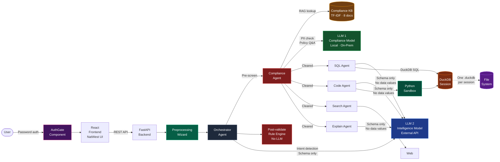
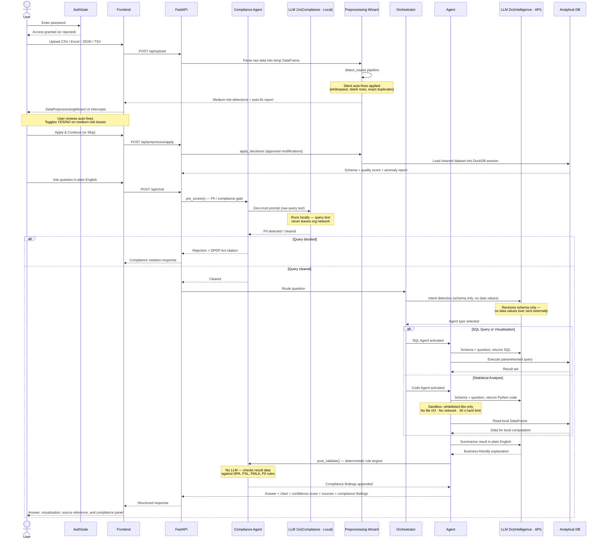

# DataTalk — NatWest Code for Purpose Hackathon 2026

**Multi-Agent Conversational AI for Financial Data Analysis | Talk to Data**

DataTalk enables any user to ask questions about their data in plain English and receive clear, verifiable answers in seconds — with regulatory compliance built into every step. No SQL, no dashboards, no data team required. Upload a dataset, ask a question, and get an answer backed by a source reference, a confidence score, a chart where applicable, and automatic validation against RBI, PMLA, and DPDP Act regulations.

The system is built on three pillars from the NatWest problem statement: **Clarity** (answers non-experts can act on immediately), **Trust** (every response cites its data source, carries a reliability rating, and has passed a compliance gateway), and **Speed** (a multi-agent pipeline routes each question to the right tool automatically, with no manual steps required).

At its architectural core, DataTalk is a **Two-LLM system**: a local compliance model that enforces company guidelines and data protection rules entirely within the organisation's network, and an external intelligence model that handles all analytical work — but only ever sees schema metadata, never actual data values.

---

## System Architecture

### High-Level Design (HLD)



### Request Flow (LLD — Sequence Diagram)



---

## Two-LLM Architecture

DataTalk is designed around a deliberate separation of two distinct LLM roles. The core insight is that not all AI calls carry the same data-sovereignty risk — and the architecture reflects that.

```
┌─────────────────────────────────────────────────────────────────────┐
│                       TWO-LLM DESIGN                               │
│                                                                     │
│   LLM 1 — Compliance / Guardian Model                              │
│   ┌─────────────────────────────────────────────────────────┐      │
│   │  Deployment: LOCAL · On-premises · Air-gapped           │      │
│   │  Sees:  Raw user query text · Policy KB chunks          │      │
│   │  Does:  PII intent detection · Policy Q&A · Doc extract │      │
│   │  Why local: Query text may contain sensitive intent      │      │
│   │             signals → must never egress the org network  │      │
│   └─────────────────────────────────────────────────────────┘      │
│                              ↕ firewall                             │
│   LLM 2 — Intelligence / Analysis Model                            │
│   ┌─────────────────────────────────────────────────────────┐      │
│   │  Deployment: EXTERNAL API (Gemini, OpenAI, Mistral…)    │      │
│   │  Sees:  Schema only — column names + types, nothing else│      │
│   │  Does:  Intent classification · SQL gen · Code gen      │      │
│   │         · Natural language summarisation                 │      │
│   │  Why API-safe: Schema carries zero sensitive payload     │      │
│   └─────────────────────────────────────────────────────────┘      │
└─────────────────────────────────────────────────────────────────────┘
```

### The reasoning behind the split

**Why LLM 1 must be local:**
When a banker types "show me Aadhaar numbers for customers in the Mumbai branch", the query text itself is a sensitive signal — it reveals intent, context, and potentially customer-identifying references. The compliance model needs to see this raw text to detect PII intent and enforce the DPDP Act. Routing that raw text through a cloud API creates an unnecessary data egress channel. A locally-deployed model keeps every compliance decision within the organisation's network boundary.

**Why LLM 2 is safe as an external API:**
The intelligence model never receives a single data value. The SQL Agent sends it `column_name TEXT, amount NUMERIC` — not the rows themselves. The Code Agent sends it a column schema. The Explain Agent sends it a summary of computed results. Because the prompt contains only structural metadata with no sensitive payload, calling an external API carries no data-privacy risk.

**The result:** Compliance enforcement is 100% on-premises. The organisation's query logs, PII signals, and policy decisions never leave its network. Meanwhile, the full capability of frontier models is available for analytical work — because those calls are provably safe.

### Role mapping

| | LLM 1 — Compliance Model | LLM 2 — Intelligence Model |
|---|---|---|
| Deployment target | Local server — Ollama, llama.cpp, LM Studio, or any local OpenAI-compatible endpoint | External API — Gemini, OpenAI, Anthropic, Mistral, Groq |
| What it receives | Raw user query text, TF-IDF retrieved policy chunks | Column names and data types only — never data values |
| Agents / calls | `pre_screen()`, `answer_compliance_question()`, PDF text extraction | Orchestrator intent classification, SQL Agent, Code Agent, Explain Agent |
| Why this placement | Query text may carry sensitive intent → must stay on-prem | Schema metadata has no sensitive payload → safe to externalise |
| Post-validate (rule engine) | Neither — deterministic code, no LLM at all | Neither |

### Current state vs. production intent

> **Current demo deployment:** Both LLM 1 and LLM 2 call the same Gemini API endpoint (`GEMINI_API_KEY` / `GEMINI_MODEL` in `.env`). This is a practical convenience for the hackathon — both roles are functionally correct, and the output is identical to the production split.
>
> **Production intent:** The compliance agent (`compliance_agent.py`) and all intelligence agents (`sql_agent.py`, `code_agent.py`, etc.) are completely separate code paths with no shared prompt context. Pointing them at different model endpoints requires changing two environment variables. The compliance agent would call a local Ollama/Mistral instance; the intelligence agents would continue calling the Gemini or OpenAI API.

### Candidate local models for LLM 1

Any instruction-tuned model that fits the organisation's hardware can serve as LLM 1. Good candidates:

| Model | Size | Notes |
|---|---|---|
| Mistral 7B Instruct | 7B | Strong instruction-following, runs on a single GPU |
| Llama 3 8B Instruct | 8B | Meta open-weights, excellent for classification tasks |
| Phi-3 Mini | 3.8B | Runs on CPU-only, suitable for low-resource deployments |
| Qwen 2.5 7B Instruct | 7B | Strong multilingual and reasoning performance |

All of these can be served locally via [Ollama](https://ollama.com) with an OpenAI-compatible API, requiring only a change to `COMPLIANCE_MODEL_BASE_URL` in `.env`.

---

https://drive.google.com/drive/folders/1fwXGXJT4ZchnP0q2d6ku4rwp8tnJidzc
(Synthetically constructed dataset for testing)

## Demo Video

https://github.com/user-attachments/assets/936c42e9-4a5b-4fc3-8b03-3b8ef8cbb8db

---

## Authentication & Access Control

The entire application is gated behind a password-authenticated entry point (`AuthGate`), implemented in `frontend/src/components/AuthGate.jsx`. No data, no queries, and no analysis tools are accessible until the user authenticates successfully.

This control is a deliberate architectural decision for a financial data analysis tool: even a demonstration deployment should not expose sensitive banking datasets or query capabilities to unauthenticated visitors.

- Authentication is enforced at the React root — the app renders nothing until the gate is passed.
- Invalid credentials trigger a shake animation and are rejected without revealing any application state.
- The gate is styled in the NatWest brand palette (deep purple background, magenta unlock button) to signal an enterprise-grade access boundary.

---

## Regulatory Compliance Engine

DataTalk treats regulatory compliance as a first-class architectural concern, not an afterthought. Every query passes through two compliance checkpoints automatically. Users can also interrogate the embedded compliance knowledge base directly.

### Three-Mode Compliance Agent

The `ComplianceAgent` (`backend/app/agents/compliance_agent.py`) operates in three modes, invoked at different points in the request lifecycle:

| Mode | When it runs | What it does |
|---|---|---|
| `pre_screen()` | Every chat query, before the orchestrator routes it | Zero-trust LLM gateway. Rejects queries that request personally identifiable information, citing the applicable regulation (DPDP Act 2023). Cleared queries proceed to the orchestrator unchanged. |
| `post_validate()` | Every result, before the response is returned | Deterministic rule engine — no LLM involved. Validates result data against four RBI and PMLA rules and appends structured compliance findings to the response. |
| `answer_compliance_question()` | `POST /api/compliance/query` | RAG-based policy Q&A. Retrieves relevant chunks from the embedded knowledge base using TF-IDF similarity and returns a cited policy answer. |

### Deterministic Rule Engine

`compliance_rules.py` contains four hardcoded, LLM-free compliance rules. These rules cannot be circumvented by query phrasing because they operate on the result data after the query has already executed.

**PII_EXPOSURE**
Blocks queries and results that expose personally identifiable information: Aadhaar numbers, PAN, SSN, CVV, passport numbers, biometric data. Grounded in the Digital Personal Data Protection Act 2023 (DPDP). Triggered at both the pre-screen and post-validate stages.

**NPA_CLASSIFICATION**
Validates NPA (Non-Performing Asset) classification against RBI IRAC norms. Flags any loan account with 61–90 Days Past Due (DPD) that is marked as "Standard" in the dataset — the correct classification under IRAC is SMA-2. Returns the count of misclassified accounts and the applicable RBI circular.

**PSL_RATIO**
Checks the Priority Sector Lending (PSL) ratio of a loan portfolio against the RBI-mandated 40% threshold. Calculates the shortfall in Crore if the portfolio falls below the target and names the relevant RBI Master Directions.

**PMLA_CTR_THRESHOLD**
Flags individual cash transactions at or above ₹10 lakh that have not been marked for Cash Transaction Report (CTR) filing, as required under the Prevention of Money Laundering Act 2002 (PMLA). Returns the count and aggregate value of unfiled transactions.

### Compliance Knowledge Base

`compliance_kb.py` implements a TF-IDF vectoriser over eight embedded markdown policy documents, loaded at application startup. There is no external vector database dependency.

**Embedded documents:**
- RBI Fair Practices Code
- RBI IRAC Norms (NPA classification)
- RBI Priority Sector Lending Guidelines
- PMLA Cash Transaction Thresholds
- DPDP Act 2023 Basics (data privacy)
- Internal Lending Policy
- User-uploaded custom documents (persisted across sessions)

**Live document ingestion:** Upload any PDF compliance document via `POST /api/compliance/upload`. The backend extracts its text content, converts it to a markdown chunk, saves it to `backend/app/compliance_docs/`, and reloads the TF-IDF index live — no application restart required.

### Compliance API Endpoints

| Endpoint | Description |
|---|---|
| `GET /api/compliance/documents` | Lists all loaded compliance documents and total chunk count |
| `POST /api/compliance/query` | Direct compliance policy Q&A (does not touch any uploaded dataset) |
| `POST /api/compliance/upload` | Upload a PDF → AI text extraction → knowledge base reload |

### Compliance in the UI

The `CompliancePanel` component surfaces compliance findings directly in the chat interface. Every response that triggers a rule violation shows the rule name, the applicable regulation, the specific finding (e.g., count of misclassified accounts), and a recommended action — inline, without requiring a separate compliance workflow.

---

## Security by Design

DataTalk treats data privacy as a hard architectural constraint, not a configuration option. The LLM has no access to your actual data at any stage. Security is enforced through six independent layers, each operating without relying on any other:

**Layer 1: Schema-only LLM prompting**
Agents send the LLM only column names and data types. The LLM returns SQL or Python targeting that schema. Query execution happens entirely on the local server. The LLM never receives a single data value.

**Layer 2: Python sandbox with hard boundaries**
Statistical analysis requires code execution, which carries inherent risk in most systems. Every piece of LLM-generated Python runs inside a restricted interpreter with a fixed import whitelist: `pandas`, `numpy`, `matplotlib`, `seaborn`, `scipy`, `sklearn`. The `open()` builtin is removed. OS, socket, and subprocess modules are inaccessible at the interpreter level. A 30-second thread-based timeout terminates any runaway or malicious execution. No data can leave the machine through generated code.

**Layer 3: Session isolation**
Every file upload is assigned a UUID. Each session maintains its own database file, its own in-memory cache, and its own connection object. No session can read, query, or infer data from another session.

**Layer 4: Sensitive column masking**
Users can flag individual columns as sensitive before querying. When a flagged column appears in a result, the Explain Agent is bypassed entirely. No LLM processes values from those columns, even indirectly.

**Layer 5: Input validation and query safety**
Accepted file extensions: `.csv`, `.xlsx`, `.xls`, `.json`, `.tsv`. Maximum upload size: 50 MB. Column names are normalised on ingest. All database queries use identifier quoting and parameterisation to prevent injection.

**Layer 6: Regulatory Compliance Gateway**
Every query passes through a two-checkpoint compliance gateway before a response is returned. At ingress, a zero-trust LLM prompt rejects queries that request personally identifiable information, citing the relevant regulation. At egress, a deterministic rule engine (no LLM involved) validates the result data against four RBI and PMLA rules. Neither checkpoint can be bypassed by query phrasing.

```
Data boundary, enforced at every step:

  Authenticated user (AuthGate)
        |
        v
  Preprocessing Wizard (local, in-memory only)
        |
        v
  Compliance pre-screen ──→ LLM 1 (local · sees raw query text · never egresses)
        |                    Rejected here if PII intent detected
        v
  Analytical DB (local server, cleaned data)
        |
        v
  Schema extracted (column names + types ONLY)
        |
        v
  Sent to LLM 2 (external API · sees schema only · raw data stops here, always)
        |
        v
  Result returned
        |
        v
  Compliance post-validate (deterministic rule engine · no LLM at all)
        |
        v
  Response with compliance findings
```

---

## Multi-Table Analysis

Upload multiple datasets into a single session and ask questions that span them.

**How it works:**
- Click the upload button to add a file. Each goes through the preprocessing wizard as a popup.
- Files are registered as named tables (e.g. `customers.csv` becomes table `customers`).
- Ask cross-dataset questions in plain English. The AI generates JOIN queries automatically.

**Example:**
> "What is the total revenue by customer region?"
> → `SELECT c.region, SUM(o.total_amount) FROM orders o JOIN customers c ON o.customer_id = c.customer_id GROUP BY c.region`

**Sidebar:** Shows each table with its own schema, data quality score, and column list.

**PDF Report:** Includes schema + preprocessing summary for every uploaded dataset.

---

## Data Preprocessing & Quality Wizard

The Data Preprocessing system is a simple, guided data-cleaning step that fits right into the upload process. It helps make sure your data is clean, well-structured, and ready for analysis, without changing anything you don't want it to.

### Three-Phase Pipeline

**Phase 1: Detection & Auto-fixes (`POST /api/upload`)**

When the user uploads a file, the backend parses it into a temporary Pandas DataFrame and runs the `detect_issues` pipeline, producing two categories of output:

- **Silent Auto-fixes (Zero Risk):** Safe transformations applied immediately, such as stripping whitespace, removing fully blank rows, and dropping exact duplicates.
- **Medium-Risk Detections:** Ambiguous issues flagged for user review, such as parsing currency symbols into numbers, standardising mixed date formats, and replacing nulls using median estimation.

The DataFrame is cached in temporary memory mapped to a `session_id`. No database is created at this stage.

**Phase 2: User Validation (`DataPreprocessingWizard.jsx`)**

A minimalist, interactive UI intercepts the loading funnel and presents the user with a full report of the auto-fixes already applied. For every medium-risk issue detected, the user sees a YES/NO toggle with a concrete data example for context. The user can either **Apply & Continue** with their chosen rules, or **Skip** to retain the raw dataset entirely.

**Phase 3: Database Serialisation (`POST /api/preprocess/apply`)**

The backend consumes the approved decisions, applies them via `apply_decisions`, and loads the cleaned dataset into the persistent DuckDB session. AI parameters like `schema`, `anomalies`, and `data_quality` are computed exclusively on this cleaned dataset.

### Preprocessing Flow

```
User uploads file
      |
      v
Pandas temp DataFrame (in-memory, no DB yet)
      |
      v
detect_issues pipeline
      |
      +---> Silent auto-fixes applied immediately
      |
      +---> Medium-risk issues → DataPreprocessingWizard UI
                  |
                  v
         User toggles YES/NO per issue
                  |
                  v
         POST /api/preprocess/apply
                  |
                  v
         apply_decisions → cleaned DataFrame
                  |
                  v
         Loaded into DuckDB session
                  |
                  v
         Schema + quality score + anomaly report
         computed on clean data only
```

### Extensibility

The engine uses a modular, class-based pipeline (`preprocessor.py`). Adding a new data cleaning rule requires only defining a class that inherits `PreprocessStep` with a `detect()` condition and an `apply()` execution body. No changes to the core pipeline are needed.

### PDF Export Integration

All data transformations, both zero-risk auto-fixes and user-approved decisions, are automatically forwarded through the chat `system` payload in `useChat.js`. When a PDF export is requested, `pdf_generator.py` parses this history to embed a chronological **"Applied Data Preprocessing" audit table** in the report, documenting exactly how the dataset was mutated before analysis began.

---

## How DataTalk Compares

Most natural language data tools send your data to a remote model to generate answers. DataTalk inverts this: the intelligence comes to your data, not the other way around.

| Dimension | Standard NL-to-Data Tools | DataTalk |
|---|---|---|
| Data sent to LLM | Full rows and values | Schema only, no data values ever |
| Analysis depth | SQL aggregations only | SQL plus sandboxed Python: stats, ML, custom charts |
| LLM provider | Vendor-locked to one API | Any provider, swapped via one line in `.env` |
| Sensitive data handling | No mechanism exists | Column-level masking with automatic agent bypass |
| Code execution safety | Unrestricted or absent | Whitelisted sandbox, file I/O blocked, 30 s hard timeout |
| Answer reliability signal | None provided | Confidence score 0 to 100 with cited data source |
| Metric consistency | Ad hoc interpretation per query | Semantic layer: define business metrics once, reuse everywhere |
| Data quality visibility | Not surfaced | Missing value analysis, duplicate detection, 3-sigma anomaly flags |
| Data cleaning before analysis | Not available | Interactive preprocessing wizard with user-controlled rules and full audit trail |
| Multi-table analysis | Single dataset only | Multiple datasets with automatic JOIN query generation |
| Regulatory compliance checking | None | Deterministic rule engine: RBI IRAC, PSL ratio, PMLA CTR, DPDP PII blocking |
| Compliance policy Q&A | None | RAG over embedded regulatory KB (RBI, PMLA, DPDP Act) — no external vector DB |
| Access control | None | Password-authenticated entry gate before any data is accessible |
| Compliance model deployment | Cloud (same model as analysis) | Designed for local / on-premises — compliance decisions and query text never egress the org network |

---

## Features

**Ask in plain English, get instant answers.** No SQL, no training, no waiting on a data team. Just type your question and the system figures out the rest.

**Multi-agent pipeline that picks the right tool for the job.** SQL for aggregations, sandboxed Python for statistics and ML, web search for external context. You don't choose the agent. The orchestrator does.

**Two-LLM architecture — compliance stays local, intelligence scales externally.** A local compliance model enforces company guidelines and data protection rules entirely within the organisation's network. A separate intelligence model handles all analytical work via external API — but only ever sees column names and types, never data values. Compliance decisions never egress. Analytical capability is uncapped.

**Compliance gateway on every query.** PII-requesting queries are blocked before they reach any data agent, with the applicable regulation cited. Every result is automatically post-validated against RBI NPA, PSL, PMLA, and DPDP Act rules — without any manual compliance workflow.

**Ask compliance questions in plain English.** "What is the RBI rule on NPA classification?" or "What are the PMLA CTR thresholds?" return cited policy answers directly from the embedded knowledge base.

**Upload your own compliance documents.** Drag in any PDF policy document and the system extracts it, indexes it into the knowledge base, and uses it for future queries — live, no restart needed.

**Password-protected access.** The entire application is gated behind authentication, ensuring only authorised users can access financial datasets and analysis tools.

**Multi-table analysis across datasets.** Upload multiple files into one session and ask questions that span all of them. The AI writes the JOINs for you, automatically.

**Your data never touches the LLM.** Only column names and types are sent to the model. Every query runs locally. This is not a policy, it is an architectural constraint baked into the system.

**Swap your LLM provider in one line.** OpenAI, Anthropic, Mistral, or any API-compatible model. Change one variable in `.env` and you are good to go.

**Sensitive columns stay hidden.** Flag any column as sensitive and the system blocks it from reaching any LLM agent, even indirectly through the Explain Agent.

**Every answer comes with a confidence score.** Rated 0 to 100, with a clear reference to the source data behind the result. You always know how much to trust the output.

**Define your metrics once, use them everywhere.** The semantic layer lets you set business definitions like "active user" or "churn rate" so every query uses the same logic.

**Charts generated automatically from your questions.** Bar, line, scatter, heatmap. Driven entirely by natural language. No drag-and-drop, no configuration panels.

**Export full sessions as PDF reports.** Every Q&A, every chart, every preprocessing step, all captured in a clean, shareable document with a full audit trail.

**Data cleaning built right into the upload flow.** The preprocessing wizard auto-fixes safe issues, flags risky ones for your approval, and gives you full control before any analysis starts.

**NatWest brand identity.** Light-theme-first design with NatWest's deep purple and magenta palette, built for enterprise-grade financial services presentation.

**Supports CSV, Excel, JSON, and TSV.** Upload files up to 50 MB. The system handles parsing, type detection, and schema extraction on its own.

---

## Tech Stack

| Layer | Technology |
|---|---|
| Frontend | React 19, Vite, Tailwind CSS, Recharts, Radix UI |
| Backend | Python 3.11, FastAPI, Uvicorn |
| Database | DuckDB (embedded columnar store, one isolated file per session) |
| Data processing | Pandas, NumPy |
| Analytics | scikit-learn, scipy, matplotlib, seaborn |
| LLM 2 — Intelligence model | Google Gemini (`GEMINI_API_KEY` / `GEMINI_MODEL` in `.env`). Swappable for any OpenAI-compatible API. |
| LLM 1 — Compliance model | Same Gemini endpoint in demo. Production target: local Ollama / llama.cpp / LM Studio instance (`COMPLIANCE_MODEL_BASE_URL` + `COMPLIANCE_MODEL_NAME`). |
| PDF reports | ReportLab |
| PDF ingestion | pypdf (compliance document upload and extraction) |
| Web search | DuckDuckGo (no API key required) |
| Compliance KB | scikit-learn TF-IDF (no external vector DB) |

---

## Install and Run

### Prerequisites

Python 3.11 or later and Node.js 20 or later.

### 1. Clone and configure

```bash
git clone <repo-url>
cd DataTalk
cp backend/.env.example backend/.env
```

Open `backend/.env` and configure your models. The system uses two distinct LLM roles:

```bash
# ── LLM 2: Intelligence / Analysis model (external API) ──────────────
# Handles: intent classification, SQL generation, code generation, summarisation
# Only ever receives schema metadata — never data values
GEMINI_API_KEY=your_gemini_api_key_here
GEMINI_MODEL=gemini-2.0-flash

# ── LLM 1: Compliance / Guardian model (local — production intent) ───
# Handles: PII intent detection, compliance Q&A, PDF extraction
# Sees raw query text → must stay on-prem in production
# Demo: leave unset to fall back to the Gemini model above
# Production: point at a local Ollama / llama.cpp / LM Studio instance
# COMPLIANCE_MODEL_BASE_URL=http://localhost:11434/v1
# COMPLIANCE_MODEL_API_KEY=ollama
# COMPLIANCE_MODEL_NAME=mistral
```

### 2. Backend

```bash
cd backend
pip install -r requirements.txt
uvicorn app.main:app --reload --port 8000
```

The compliance knowledge base is loaded automatically at startup. You will see a log line confirming the number of policy document chunks indexed.

### 3. Frontend

```bash
cd frontend
npm install
npm run dev
# Opens at http://localhost:5173
```

---

## Usage Examples

Upload any structured dataset, then ask in plain English:

```
"Why did revenue drop last month?"
-> Revenue fell 11% in February. South region contributed 22% of the decline due to reduced ad spend.

"Show the correlation between customer age and transaction value"
-> Heatmap generated inside the Python sandbox. The LLM received only column names, not values.

"Compare Product A and Product B this quarter"
-> Product A grew 8% week-on-week, outperforming Product B at 2%. Primary driver: higher return customer rate.

"What makes up total sales by region?"
-> North accounts for 40% of total sales. Retail contributes the majority within that share.

"Give me a weekly summary of customer metrics"
-> Signups up 5%, churn stable, average handle time improved by 12 seconds.
```

**Compliance query examples:**

```
"What is the RBI rule on NPA classification?"
-> Under RBI IRAC norms, a loan account with 61–90 DPD should be classified as SMA-2...

"Flag any loans in my dataset that breach IRAC classification rules"
-> 3 accounts found with 61–90 DPD marked as Standard. Correct classification under RBI circular RBI/2021-22/125 is SMA-2.

"Are there any cash transactions I need to file CTRs for?"
-> 7 transactions at or above ₹10 lakh detected. Total value: ₹93.4 lakh. CTR filing required under PMLA 2002, Section 12.
```

---

## Architecture Notes & Decisions Explained

The application uses a multi-agent orchestration pattern. The Orchestrator classifies each incoming question into one of five intent categories and routes it to the appropriate specialist agent. Agents use the LLM only to translate intent into executable SQL or Python. Execution happens locally against the embedded analytical database, so the LLM acts as a translator, not a data processor.

**Two-LLM design:** The system separates compliance intelligence from analytical intelligence across two distinct model roles. LLM 1 (the Compliance / Guardian model) is designed for local on-premises deployment because it processes raw user query text — which may carry sensitive intent signals such as account references, customer names, or regulatory edge cases. LLM 2 (the Intelligence / Analysis model) is designed for external API access because it only ever processes schema metadata (column names and types), which carries no sensitive payload. The Compliance Agent (`compliance_agent.py`) and all intelligence agents are completely separate code paths with no shared prompt context, making the production split a two-variable config change. In the current demo, both call the same Gemini API endpoint.

The Compliance Agent sits outside the main agent routing path and operates at the API boundary. It runs before the orchestrator (pre-screen) and after the agent returns a result (post-validate), ensuring compliance checks are independent of which agent handled the query. The deterministic rule engine in post-validate uses no LLM at all — it applies pattern-matching and threshold checks directly against the structured result data.

DuckDB was selected for its columnar storage model, embedded execution with zero server infrastructure, and native support for Pandas DataFrames. Each session writes to its own isolated database file, ensuring complete data separation between users.

The Python sandbox is central to the system's analytical depth. Correlations, distributions, regressions, and clustering all require code execution that SQL cannot express. The sandbox makes this safe without sacrificing capability: the LLM generates code against column metadata, the sandbox executes it in isolation, and the result flows back to the user as a chart or summary.

The Preprocessing Wizard runs before data ever reaches DuckDB. By resolving data quality issues in a separate, user-validated phase, the wizard ensures that every subsequent SQL query, Python computation, and confidence score operates on the cleanest possible version of the dataset, and that the user retains full control over what was changed.

Multi-table analysis extends this foundation by allowing multiple cleaned datasets to coexist within a single DuckDB session. The SQL Agent receives the combined schema of all registered tables, enabling it to generate JOIN queries that span datasets, while still never exposing raw data values to the LLM.

---

## Folder Structure

```
DataTalk/
├── backend/
│   ├── app/
│   │   ├── agents/            # Orchestrator, SQL, Code, Search, Explain, Compliance agents
│   │   ├── core/              # DB manager, schema, compliance KB (TF-IDF), compliance rules, confidence scoring
│   │   ├── routes/            # Upload, chat, preprocess, compliance, export, semantic, models
│   │   ├── compliance_docs/   # 8 embedded RBI/PMLA/DPDP markdown policy documents
│   │   ├── models/            # Pre-trained ML models (isolation forest, random forest, etc.)
│   │   └── utils/             # LLM client, Python sandbox, PDF generator, preprocessor
│   ├── requirements.txt
│   └── .env.example
├── frontend/
│   ├── src/
│   │   ├── components/        # React UI components incl. AuthGate, CompliancePanel, DataPreprocessingWizard
│   │   ├── hooks/             # Chat state, backend health
│   │   ├── context/           # ThemeContext (light/dark mode)
│   │   └── services/          # Axios API client
│   └── package.json
├── docs/                      # Architecture and planning documents
└── README.md
```
