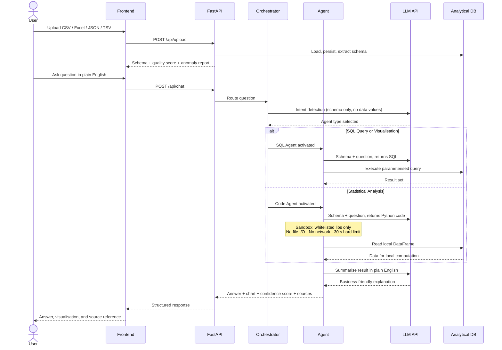

# DataTalk — Seamless Self-Service Intelligence

**NatWest Code for Purpose India Hackathon 2026 | Talk to Data**

DataTalk enables any user to ask questions about their data in plain English and receive clear, verifiable answers in seconds. No SQL, no dashboards, no data team required. Upload a dataset, ask a question, and get an answer backed by a source reference, a confidence score, and a chart where applicable.

The system is built on three pillars from the NatWest problem statement: **Clarity** (answers non-experts can act on immediately), **Trust** (every response cites its data source and carries a reliability rating), and **Speed** (a multi-agent pipeline routes each question to the right tool automatically, with no manual steps required).

---

## System Architecture

### High-Level Design (HLD)

graph LR
    U([👤 User]) --> FE["React\nFrontend"]
    FE -->|REST API| BE["FastAPI\nBackend"]
    BE --> O["🧠 Orchestrator\nAgent"]

    O --> SA["SQL Agent"]
    O --> CA["Code Agent"]
    O --> WA["Search Agent"]
    O --> EA["Explain Agent"]

    SA & CA -->|"Schema Only\n⛔ No Raw Data"| LLM["☁️ Any LLM\nAPI"]

    SA -->|DuckDB SQL| DB[("DuckDB\nSession")]
    CA --> SB["🔒 Python\nSandbox"]
    SB --> DB
    WA --> WEB["🌐 Web"]
    DB -.->|One .duckdb\nper session| FS[("File\nSystem")]

    style LLM fill:#1e3a8a,color:#fff,stroke:#3b82f6
    style SB fill:#14532d,color:#fff,stroke:#22c55e
    style DB fill:#7c2d12,color:#fff,stroke:#f97316
    style FS fill:#581c87,color:#fff,stroke:#a855f7
    style O fill:#1e293b,color:#fff,stroke:#64748b

### Request Flow (LLD — Sequence Diagram)



---

## Security by Design

DataTalk treats data privacy as a hard architectural constraint, not a configuration option. The LLM has no access to your actual data at any stage. Security is enforced through five independent layers, each operating without relying on any other:

**Layer 1 — Schema-only LLM prompting**
Agents send the LLM only column names and data types. The LLM returns SQL or Python targeting that schema. Query execution happens entirely on the local server. The LLM never receives a single data value.

**Layer 2 — Python sandbox with hard boundaries**
Statistical analysis requires code execution, which carries inherent risk in most systems. Every piece of LLM-generated Python runs inside a restricted interpreter with a fixed import whitelist: `pandas`, `numpy`, `matplotlib`, `seaborn`, `scipy`, `sklearn`. The `open()` builtin is removed. OS, socket, and subprocess modules are inaccessible at the interpreter level. A 30-second thread-based timeout terminates any runaway or malicious execution. No data can leave the machine through generated code.

**Layer 3 — Session isolation**
Every file upload is assigned a UUID. Each session maintains its own database file, its own in-memory cache, and its own connection object. No session can read, query, or infer data from another session.

**Layer 4 — Sensitive column masking**
Users can flag individual columns as sensitive before querying. When a flagged column appears in a result, the Explain Agent is bypassed entirely. No LLM processes values from those columns, even indirectly.

**Layer 5 — Input validation and query safety**
Accepted file extensions: `.csv`, `.xlsx`, `.xls`, `.json`, `.tsv`. Maximum upload size: 50 MB. Column names are normalised on ingest. All database queries use identifier quoting and parameterisation to prevent injection.

```
Data boundary — enforced at every step:

  User uploads file
        |
        v
  Analytical DB (local server)
        |
        v
  Schema extracted (names + types only)
        |
        v
  Sent to LLM
        |
  Raw data stops here, always
```

---

## How DataTalk Compares

Most natural language data tools send your data to a remote model to generate answers. DataTalk inverts this: the intelligence comes to your data, not the other way around.

| Dimension | Standard NL-to-Data Tools | DataTalk |
|---|---|---|
| Data sent to LLM | Full rows and values | Schema only — no data values ever |
| Analysis depth | SQL aggregations only | SQL plus sandboxed Python: stats, ML, custom charts |
| LLM provider | Vendor-locked to one API | Any provider, swapped via one line in `.env` |
| Sensitive data handling | No mechanism exists | Column-level masking with automatic agent bypass |
| Code execution safety | Unrestricted or absent | Whitelisted sandbox, file I/O blocked, 30 s hard timeout |
| Answer reliability signal | None provided | Confidence score 0 to 100 with cited data source |
| Metric consistency | Ad hoc interpretation per query | Semantic layer: define business metrics once, reuse everywhere |
| Data quality visibility | Not surfaced | Missing value analysis, duplicate detection, 3-sigma anomaly flags |

---

## Features

- Natural language to instant insight with no SQL knowledge required
- Multi-agent pipeline: SQL for aggregations, sandboxed Python for statistics, web search for external context
- Schema-only LLM prompting: raw data stays on your server at all times
- Pluggable LLM backend: swap any provider by changing one environment variable
- Sensitive column protection: user-controlled masking enforced at the agent level
- Confidence scoring: every answer rated 0 to 100 with transparent source references
- Semantic layer: define and reuse custom business metrics across all queries
- Auto-generated charts: bar, line, scatter, and heatmap driven by natural language
- PDF export: download full Q&A sessions as formatted, shareable reports
- Data quality dashboard: missing values, duplicates, and anomaly detection on upload
- Multi-format upload: CSV, Excel, JSON, and TSV files up to 50 MB

---

## Tech Stack

| Layer | Technology |
|---|---|
| Frontend | React 19, Vite, Tailwind CSS, Recharts, Radix UI |
| Backend | Python 3.11, FastAPI, Uvicorn |
| Database | DuckDB (embedded columnar store, one isolated file per session) |
| Data processing | Pandas, NumPy |
| Analytics | scikit-learn, scipy, matplotlib, seaborn |
| LLM | Any provider via API (configured in `.env`) |
| PDF reports | ReportLab |
| Web search | DuckDuckGo (no API key required) |

---

## Install and Run

### Prerequisites

Python 3.11 or later and Node.js 20 or later.

### 1. Clone and configure

```bash
git clone <repo-url>
cd DataTalk
cp backend/.env.example backend/.env
# Add your LLM API key to backend/.env
```

### 2. Backend

```bash
cd backend
pip install -r requirements.txt
uvicorn app.main:app --reload --port 8000
```

### 3. Frontend

```bash
cd frontend
npm install
npm run dev
# Opens at http://localhost:5173
```

---

## Usage Examples

Upload any structured dataset, then ask in plain English:

```
"Why did revenue drop last month?"
-> Revenue fell 11% in February. South region contributed 22% of the decline due to reduced ad spend.

"Show the correlation between customer age and transaction value"
-> Heatmap generated inside the Python sandbox. The LLM received only column names, not values.

"Compare Product A and Product B this quarter"
-> Product A grew 8% week-on-week, outperforming Product B at 2%. Primary driver: higher return customer rate.

"What makes up total sales by region?"
-> North accounts for 40% of total sales. Retail contributes the majority within that share.

"Give me a weekly summary of customer metrics"
-> Signups up 5%, churn stable, average handle time improved by 12 seconds.
```

---

## Architecture Notes

DataTalk uses a multi-agent orchestration pattern. The Orchestrator classifies each incoming question into one of five intent categories and routes it to the appropriate specialist agent. Agents use the LLM only to translate intent into executable SQL or Python. Execution happens locally against the embedded analytical database, so the LLM acts as a translator, not a data processor.

DuckDB was selected for its columnar storage model, embedded execution with zero server infrastructure, and native support for Pandas DataFrames. Each session writes to its own isolated database file, ensuring complete data separation between users.

The Python sandbox is central to the system's analytical depth. Correlations, distributions, regressions, and clustering all require code execution that SQL cannot express. The sandbox makes this safe without sacrificing capability: the LLM generates code against column metadata, the sandbox executes it in isolation, and the result flows back to the user as a chart or summary.

---

## Folder Structure

```
DataTalk/
├── backend/
│   ├── app/
│   │   ├── agents/       # Orchestrator, SQL, Code, Search, Explain agents
│   │   ├── core/         # DB manager, schema analysis, confidence scoring
│   │   ├── routes/       # Upload, chat, semantic layer, PDF export
│   │   └── utils/        # LLM client, Python sandbox, PDF generator
│   ├── requirements.txt
│   └── .env.example
├── frontend/
│   ├── src/
│   │   ├── components/   # React UI components
│   │   ├── hooks/        # Chat state, backend health
│   │   └── services/     # Axios API client
│   └── package.json
├── docs/                 # Architecture and planning documents
└── README.md
```
