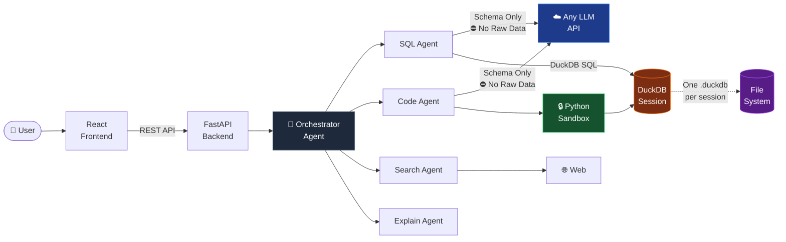
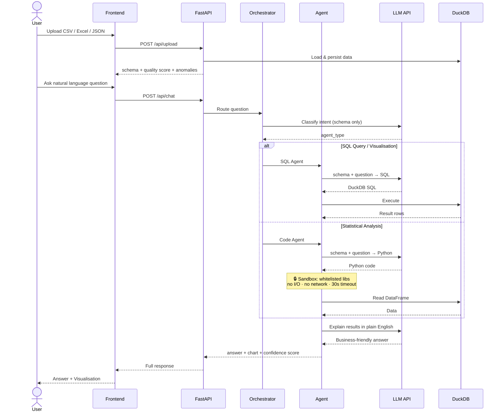

# DataTalk — Talk to Your Data, Trust Every Answer

> **NatWest Code for Purpose India Hackathon 2026**
> *Self-service business intelligence through natural language — secure, fast, and model-agnostic.*

---

## The Core Problem (And Why Most Solutions Miss It)

Thousands of tools let users "chat with data." Most of them **send your raw data rows to an external AI model** — a serious privacy and compliance risk. DataTalk is architecturally different: **your actual data never leaves your server.** The LLM only ever sees column names and types. Never values.

---

## System Architecture

### High-Level Design (HLD)



### Low-Level Design (LLD) — Request Sequence



---

## What Sets DataTalk Apart

| | Typical "Chat with Data" | **DataTalk** |
|---|---|---|
| Raw data sent to LLM | Yes — full rows | **Never — schema only** |
| Statistical analysis | SQL only | **SQL + sandboxed Python** |
| Model flexibility | Vendor-locked | **Any LLM provider** |
| Sensitive data control | None | **Column-level masking** |
| Code execution safety | Uncontrolled | **Whitelist sandbox + 30 s timeout** |
| Answer reliability | No indicator | **Confidence score 0–100** |

---

## Features

- **Natural language → instant insights** — no SQL knowledge needed
- **Multi-agent orchestration** — SQL for aggregations, Python for statistics, web for context
- **Security-first design** — raw data never reaches the LLM; schema-only prompting
- **Any LLM, any provider** — model-agnostic; swap providers via a single `.env` variable
- **Sandboxed Python execution** — statistical analysis with zero data-leak risk
- **Sensitive column protection** — mark columns to exclude from all AI processing
- **Confidence scoring** — every answer rated 0–100 with source transparency
- **Auto-generated charts** — bar, line, scatter, heatmap from natural language
- **Semantic layer** — define custom business metrics (e.g. `churn_rate = churned / total`)
- **PDF export** — download full Q&A sessions as formatted reports
- **Data quality dashboard** — missing values, duplicate detection, anomaly alerts
- **Multi-format upload** — CSV, Excel, JSON, TSV (up to 50 MB)

---

## Tech Stack

| Layer | Technology |
|---|---|
| **Frontend** | React 19, Vite, Tailwind CSS, Recharts, Radix UI |
| **Backend** | Python 3.11, FastAPI, Uvicorn |
| **Database** | DuckDB — one isolated `.duckdb` session file per upload |
| **Data processing** | Pandas, NumPy |
| **Analytics** | scikit-learn, scipy, matplotlib, seaborn |
| **LLM** | Any provider via API (configured via `.env`) |
| **PDF reports** | ReportLab |
| **Web search** | DuckDuckGo (no API key required) |

---

## Install & Run

### Prerequisites
- Python 3.11+, Node.js 20+

### 1. Clone & configure
```bash
git clone <repo-url> && cd DataTalk
cp backend/.env.example backend/.env
# Add your LLM API key in backend/.env
```

### 2. Backend
```bash
cd backend
pip install -r requirements.txt
uvicorn app.main:app --reload --port 8000
```

### 3. Frontend
```bash
cd frontend
npm install
npm run dev
# Opens at http://localhost:5173
```

---

## Usage Examples

Upload any dataset and ask in plain English:

```
"Why did revenue drop last month?"
→ Revenue fell 11% in February. South region drove 22% of the drop due to reduced ad spend.

"Show correlation between age and transaction value"
→ Heatmap generated entirely in the Python sandbox — raw data never touches the LLM.

"Compare Product A vs Product B this quarter"
→ Product A grew 8% WoW vs Product B (+2%). Primary driver: higher returning customer rate.

"Give me a weekly summary of customer metrics"
→ Signups +5%, churn stable, average handle time improved by 12 seconds.

"What makes up total sales by region?"
→ North accounts for 40% of total sales; Retail contributes the majority of that share.
```

---

## The Python Sandbox — A Key Differentiator

Most "chat with data" tools are SQL-only. Real statistical analysis — correlations, distributions, regression, clustering — requires code execution. The risk: an LLM could generate code that reads your filesystem, calls the network, or leaks data.

DataTalk's sandbox enforces hard boundaries:

- **Whitelisted imports only**: `pandas`, `numpy`, `matplotlib`, `seaborn`, `scipy`, `sklearn` — nothing else loads
- **No file I/O**: `open()` is blocked; no read or write to disk from generated code
- **No network or subprocess**: OS, socket, and subprocess modules are inaccessible
- **30-second hard timeout**: thread-based enforcement stops runaway or malicious loops
- **Fresh isolated namespace**: every execution is scoped; no state leaks between queries

The LLM receives only the **schema and column names** to generate code — it never sees your actual data values.

---

## Security Architecture

```
User Data Path:
  Upload → DuckDB (local) → schema extracted → schema sent to LLM
                                  ↑
                      Raw data stops here — always
```

- **Session isolation**: every upload gets a UUID; sessions never share state
- **SQL injection prevention**: parameterised DuckDB queries; schema-only prompting
- **Sensitive columns**: user-marked columns excluded from all AI explanations
- **File validation**: extension whitelist (`.csv .xlsx .json .tsv`) + 50 MB cap
- **CORS**: locked to frontend origin only
- **No secrets in code**: all credentials via environment variables

---

## Folder Structure

```
DataTalk/
├── backend/
│   ├── app/
│   │   ├── agents/       # Orchestrator, SQL, Code, Search, Explain agents
│   │   ├── core/         # DuckDB manager, schema analysis, confidence scoring
│   │   ├── routes/       # Upload, chat, semantic layer, PDF export endpoints
│   │   └── utils/        # LLM client, Python sandbox, PDF generator
│   ├── requirements.txt
│   └── .env.example
├── frontend/
│   ├── src/
│   │   ├── components/   # React UI components
│   │   ├── hooks/        # Chat state, backend health check
│   │   └── services/     # Axios API client
│   └── package.json
├── docs/                 # Architecture and planning docs
└── README.md
```

---

## Architecture Notes

DataTalk uses a **multi-agent orchestration pattern**. The Orchestrator classifies each question into one of five intent types and routes it to the appropriate specialist agent. Agents communicate with the LLM using only metadata — making the system safe to deploy with any cloud AI provider without data residency concerns.

DuckDB was chosen over SQLite or PostgreSQL for its **columnar analytical performance** and its ability to run as an embedded process with zero infrastructure. Each session gets its own `.duckdb` file, ensuring complete data isolation between users.

---

## Limitations

- Complex multi-table joins across separate uploaded files are not yet supported
- Web search enrichment adds ~2–3 s latency per query
- PDF export does not yet embed chart images inline

## Future Improvements

- Direct database connections (PostgreSQL, Snowflake, BigQuery)
- Streaming responses for large result sets
- Role-based access control for team deployments
- Local LLM support (Ollama) for fully air-gapped deployments
