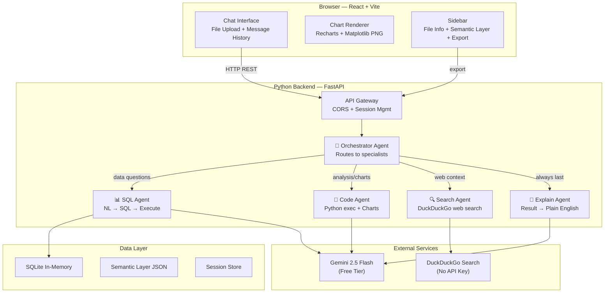

# DataTalk — Master Implementation Plan
## NatWest Code for Purpose Hackathon | Theme 1: Talk to Data
### 🕐 Deadline: 2 Days | 👥 Team: 3 People

> **Vision:** Build a multi-agent AI data analyst that feels like having a senior data scientist on your team. Upload CSV/Excel → ask anything in plain English → get charts, code, explanations, and downloadable reports. All powered by free-tier Gemini 2.5 Flash.

---

## Architecture Overview



### Why This Architecture Wins Over Other Teams

| Decision | Why It's Better |
|---|---|
| **Multi-agent routing** | Most teams will use a single LLM call. We have 4 specialist agents that produce richer, more accurate outputs. |
| **Code Interpreter agent** | We can **execute Python code** — generate matplotlib charts, run correlations, build pivot tables. Most teams can only do SQL. |
| **No Node.js middleware** | FastAPI handles everything: REST, CORS, file upload, streaming. One less deployment = fewer bugs. |
| **DuckDuckGo** (no API key) | Free, instant web search. No NewsAPI key management. |
| **Schema-only to LLM** | Raw data NEVER leaves the server. Only column names + types go to Gemini. Privacy guard built-in. |
| **Confidence Score** | No other team will implement this. Directly addresses NatWest's "lack of confidence in data" pain point. |

---

## Folder Structure

```
Natwest_Project/
├── frontend/                          # Person A owns this
│   ├── public/
│   │   └── favicon.svg
│   ├── src/
│   │   ├── components/
│   │   │   ├── ChatInterface.jsx      # Main chat window
│   │   │   ├── MessageBubble.jsx      # Individual message card
│   │   │   ├── FileUpload.jsx         # Drag & drop upload
│   │   │   ├── ChartRenderer.jsx      # Recharts + base64 PNG
│   │   │   ├── ConfidenceScore.jsx    # Confidence badge
│   │   │   ├── DataPreview.jsx        # Schema display card
│   │   │   ├── SemanticLayerEditor.jsx# Metric definitions
│   │   │   ├── Sidebar.jsx            # Left panel
│   │   │   ├── CodeBlock.jsx          # Syntax-highlighted code
│   │   │   └── WelcomeScreen.jsx      # Initial landing state
│   │   ├── hooks/
│   │   │   └── useChat.js             # Chat state management
│   │   ├── services/
│   │   │   └── api.js                 # All API calls
│   │   ├── App.jsx
│   │   ├── App.css
│   │   ├── main.jsx
│   │   └── index.css
│   ├── index.html
│   ├── vite.config.js
│   ├── tailwind.config.js
│   └── package.json
│
├── backend/                           # Person B + C own this
│   ├── app/
│   │   ├── main.py                    # FastAPI entry (Person B)
│   │   ├── routes/
│   │   │   ├── upload.py              # POST /api/upload (Person B)
│   │   │   ├── chat.py                # POST /api/chat (Person B)
│   │   │   ├── semantic.py            # GET/POST /api/semantic-layer (Person B)
│   │   │   └── export.py              # POST /api/export-pdf (Person B)
│   │   ├── agents/
│   │   │   ├── orchestrator.py        # Agent router (Person C)
│   │   │   ├── sql_agent.py           # NL→SQL→Execute (Person C)
│   │   │   ├── code_agent.py          # Python code gen+exec (Person C)
│   │   │   ├── search_agent.py        # Web search (Person C)
│   │   │   └── explain_agent.py       # Plain English + citations (Person C)
│   │   ├── core/
│   │   │   ├── database.py            # SQLite manager (Person B)
│   │   │   ├── schema.py              # Schema extraction (Person B)
│   │   │   ├── semantic_layer.py      # Semantic layer CRUD (Person B)
│   │   │   ├── confidence.py          # Confidence calculator (Person C)
│   │   │   └── file_handler.py        # CSV/Excel parser (Person B)
│   │   └── utils/
│   │       ├── gemini_client.py        # Gemini API wrapper (Person C)
│   │       ├── code_sandbox.py         # Safe exec() (Person C)
│   │       └── pdf_generator.py        # ReportLab PDF (Person B)
│   ├── tests/
│   │   ├── test_upload.py
│   │   ├── test_chat.py
│   │   └── test_agents.py
│   ├── sample_data/
│   │   └── banking_transactions.csv   # Demo dataset
│   ├── requirements.txt
│   └── .env.example
│
├── docs/
│   ├── architecture.md
│   └── api_reference.md
├── README.md
├── .gitignore
└── .env.example
```

---

## API Contract (Person A↔B must agree on this)

> [!IMPORTANT]
> Person A (frontend) and Person B (backend) **must use exactly these endpoints**. Copy this contract into both your codebases as a reference.

### `POST /api/upload`
```json
// Request: multipart/form-data with file field "file"

// Response 200:
{
  "session_id": "uuid-string",
  "filename": "transactions.csv",
  "row_count": 2450,
  "column_count": 13,
  "schema": [
    {
      "name": "transaction_id",
      "type": "INTEGER",
      "sample_values": ["1001", "1002", "1003"],
      "missing_pct": 0.0
    },
    {
      "name": "amount",
      "type": "REAL",
      "sample_values": ["150.50", "2300.00", "45.99"],
      "missing_pct": 2.1
    }
  ],
  "data_quality": {
    "overall_score": 87,
    "total_missing_pct": 3.2,
    "duplicate_rows": 12,
    "issues": ["Column 'notes' has 45% missing values"]
  },
  "suggested_metrics": [
    {"name": "total_amount", "expression": "SUM(amount)", "description": "Sum of all transaction amounts"},
    {"name": "avg_amount", "expression": "AVG(amount)", "description": "Average transaction amount"}
  ]
}
```

### `POST /api/chat`
```json
// Request:
{
  "session_id": "uuid-string",
  "question": "What is the total revenue by region?",
  "options": {
    "include_chart": true,
    "include_web_search": true
  }
}

// Response 200:
{
  "answer": "The total revenue across all regions is $4.2M. The North region leads with $1.8M (43%), followed by South at $1.1M (26%), East at $780K (19%), and West at $520K (12%).",
  "agent_used": "sql_agent",
  "sql_query": "SELECT region, SUM(amount) as total FROM transactions GROUP BY region ORDER BY total DESC",
  "python_code": null,
  "chart": {
    "type": "bar",
    "data": [
      {"name": "North", "value": 1800000},
      {"name": "South", "value": 1100000},
      {"name": "East", "value": 780000},
      {"name": "West", "value": 520000}
    ],
    "x_key": "name",
    "y_key": "value",
    "title": "Total Revenue by Region"
  },
  "matplotlib_image": null,
  "confidence": {
    "score": 87,
    "level": "High",
    "breakdown": {
      "row_coverage": 95,
      "data_completeness": 92,
      "schema_match": 100,
      "web_corroboration": 60
    }
  },
  "sources": [
    {"type": "column", "value": "region, amount (2,450 rows)"},
    {"type": "web", "value": "Regional banking growth trends Q1 2024", "url": "https://..."}
  ],
  "timestamp": "2026-04-10T15:30:00Z"
}
```

### `GET /api/semantic-layer?session_id=xxx`
```json
// Response 200:
{
  "metrics": [
    {"name": "revenue", "expression": "SUM(amount)", "description": "Total revenue"},
    {"name": "active_customers", "expression": "COUNT(DISTINCT customer_id) WHERE status='active'", "description": "Unique active customers"}
  ]
}
```

### `POST /api/semantic-layer`
```json
// Request:
{
  "session_id": "uuid-string",
  "metrics": [
    {"name": "revenue", "expression": "SUM(amount)", "description": "Total net revenue"}
  ]
}
// Response 200: { "status": "ok", "count": 1 }
```

### `POST /api/export-pdf`
```json
// Request:
{
  "session_id": "uuid-string",
  "messages": [
    {
      "role": "user",
      "content": "What is total revenue?",
      "timestamp": "..."
    },
    {
      "role": "assistant",
      "content": "Total revenue is $4.2M...",
      "sql_query": "SELECT SUM(amount)...",
      "confidence": {"score": 87, "level": "High"},
      "sources": [...]
    }
  ]
}
// Response: application/pdf binary stream
```

---

## Team Work Division

### 🟦 Person A — Frontend (React + Vite + TailwindCSS)
**Estimated time: 10-12 hours across 2 days**

### 🟩 Person B — Backend API + Infrastructure (FastAPI + SQLite)
**Estimated time: 8-10 hours across 2 days**

### 🟧 Person C — AI Core + Multi-Agent System (Gemini + Agents)
**Estimated time: 10-12 hours across 2 days**

---

## Build Timeline

### Day 1 — Core Foundation

| Time | Person A (Frontend) | Person B (Backend API) | Person C (AI Core) |
|---|---|---|---|
| **Hour 1-2** | Scaffold Vite+React+Tailwind. Create App shell, dark theme, layout grid. | Scaffold FastAPI. Create `main.py`, CORS, session store, folder structure. | Set up Gemini client. Test basic prompt. Create `.env.example`. |
| **Hour 3-4** | Build `FileUpload.jsx` (drag & drop). Build `DataPreview.jsx`. | Build `POST /api/upload`: file parsing (CSV/Excel/JSON), SQLite loading, schema extraction. | Build `sql_agent.py`: NL→SQL→Execute pipeline with retry logic. |
| **Hour 5-6** | Build `ChatInterface.jsx` + `MessageBubble.jsx`. Wire to `/api/chat`. | Build `POST /api/chat`: receive question, call orchestrator, return structured response. | Build `orchestrator.py`: classify intent, route to correct agent. |
| **Hour 7-8** | Build `ChartRenderer.jsx` (Recharts bar/line/pie). Build `CodeBlock.jsx`. | Integration testing with Person C. Fix API response formats. | Build `code_agent.py`: Python code generation + sandboxed execution + matplotlib capture. |
| **EOD 1** | ✅ Can upload file, ask questions, see answers + charts | ✅ All endpoints working, data flows end-to-end | ✅ SQL + Code agents working, orchestrator routing |

### Day 2 — Differentiators + Polish

| Time | Person A (Frontend) | Person B (Backend API) | Person C (AI Core) |
|---|---|---|---|
| **Hour 1-2** | Build `ConfidenceScore.jsx`. Build `Sidebar.jsx` with file info + privacy badge. | Build `POST /api/export-pdf` with ReportLab. | Build `search_agent.py` (DuckDuckGo). Build `explain_agent.py` with citations. |
| **Hour 3-4** | Build `SemanticLayerEditor.jsx`. Add source citations to messages. | Build semantic layer CRUD endpoints. Create demo dataset. | Build `confidence.py` calculator. Integrate web search into explain agent. |
| **Hour 5-6** | Polish: animations, loading skeletons, error states, responsive design. | Write `README.md`. Create `tests/`. Final API hardening. | Tune prompts. Handle edge cases (bad SQL, empty results, large schemas). |
| **Hour 7-8** | End-to-end testing. Screenshot for README. | `.gitignore`, `.env.example`, submission checklist. | End-to-end testing with demo dataset. Prepare demo script. |
| **EOD 2** | ✅ Beautiful, polished, fully functional UI | ✅ All endpoints, PDF, tests, docs complete | ✅ All agents working, confidence scores, web search |

---

## Tech Stack

| Layer | Technology | Cost |
|---|---|---|
| Frontend | React 18 + Vite 6 + TailwindCSS 3 | Free |
| Charts | Recharts | Free |
| Code Highlighting | react-syntax-highlighter | Free |
| Backend | Python 3.11+ FastAPI | Free |
| LLM | Gemini 2.5 Flash (Google AI Studio free tier, ~10 RPM) | Free |
| Database | SQLite (in-memory, per-session) | Free |
| Data Processing | Pandas + NumPy + openpyxl | Free |
| Web Search | duckduckgo-search (Python) | Free, no API key |
| PDF Export | ReportLab | Free |
| Font | Inter (Google Fonts) | Free |

---

## Design System

### Color Palette (Dark Mode First)
```css
--bg-primary: #0a0e1a;        /* Deep navy background */
--bg-secondary: #111827;       /* Card backgrounds */
--bg-tertiary: #1f2937;        /* Input fields, hover states */
--accent-blue: #3b82f6;        /* Primary buttons, links */
--accent-purple: #8b5cf6;      /* AI agent badges, highlights */
--accent-green: #10b981;       /* Success, high confidence */
--accent-amber: #f59e0b;       /* Warning, medium confidence */
--accent-red: #ef4444;         /* Error, low confidence */
--text-primary: #f1f5f9;       /* Main text */
--text-secondary: #94a3b8;     /* Muted text */
--glass: rgba(255,255,255,0.05); /* Glass morphism panels */
--glass-border: rgba(255,255,255,0.1);
```

### Typography
```
Font: Inter (Google Fonts)
Headings: 600-700 weight
Body: 400 weight
Code: JetBrains Mono or Fira Code
```

### Key UI Components

1. **Chat Messages** — Glass morphism cards with subtle border glow
2. **Charts** — Dark background, accent-colored bars/lines, smooth animations
3. **Confidence Badge** — Circular progress ring with animated fill
4. **File Upload** — Dashed border zone with pulse animation on drag-over
5. **Sidebar** — Frosted glass panel with file info + metrics
6. **Code Blocks** — Dark syntax-highlighted with copy button

---

## Gemini Prompts (Copy-Paste Ready for Person C)

### Prompt 1 — Orchestrator (Intent Classification)
```
System: You are a routing agent for a data analysis platform. Given a user question and a database schema, classify the question into exactly one category.

Categories:
- "sql_query": Questions answerable with a SQL query (aggregations, filters, grouping, counts)
- "visualization": Questions requesting charts, plots, or visual representation of data
- "statistical_analysis": Questions requiring Python code (correlations, distributions, regressions, comparisons)
- "web_search": Questions about external context, news, trends, or events not in the data
- "general": Greetings, meta-questions about the data, or questions about the tool itself

Schema: {schema_json}
Semantic Layer: {semantic_layer_json}

Respond with ONLY a JSON object: {"category": "...", "needs_chart": true/false, "chart_type": "bar|line|pie|scatter|area|none", "search_query": "..." or null}
```

### Prompt 2 — SQL Agent (NL → SQL)
```
System: You are a SQLite SQL expert. Given this database schema and metric definitions, generate ONLY a valid SQLite SQL query. Rules:
1. ONLY reference columns that exist in the schema
2. Use metric definitions from the semantic layer when the user references a defined metric
3. Always include meaningful aliases with AS
4. For time-series: ORDER BY date/time column
5. For comparisons: include all relevant grouping columns
6. LIMIT 100 unless user specifies otherwise
7. Output ONLY the SQL query — no markdown, no explanation, no backticks

Schema: {schema_json}
Semantic Layer: {semantic_layer_json}

User: {question}
```

### Prompt 3 — Code Agent (Python Generation)
```
System: You are a Python data analyst. Generate a Python script to answer the user's question using the provided DataFrame.

Available libraries: pandas, numpy, matplotlib, seaborn, scipy
The DataFrame is pre-loaded as variable `df` with these columns: {schema_json}

Rules:
1. Always start with data exploration relevant to the question
2. Generate matplotlib/seaborn charts when useful — save to `_figures` list as base64:
   ```python
   import io, base64
   buf = io.BytesIO()
   plt.savefig(buf, format='png', dpi=150, bbox_inches='tight', facecolor='#111827', edgecolor='none')
   buf.seek(0)
   _figures.append(base64.b64encode(buf.read()).decode())
   plt.close()
   ```
3. Use dark theme for all charts: plt.style.use('dark_background')
4. Print the final answer clearly using print()
5. Handle missing values gracefully
6. Output ONLY Python code — no markdown, no backticks
```

### Prompt 4 — Explain Agent (Result → Plain English)
```
System: You are a friendly data analyst explaining results to a business user who is NOT technical.

Context:
- User asked: {original_question}
- Agent used: {agent_type}
- SQL query (if any): {sql_query}
- Columns used: {columns_used}
- Row count used: {row_count}
- Total rows in dataset: {total_rows}
- Web search results (if any): {web_results}

Rules:
1. Start with the DIRECT answer in the first sentence
2. Use 2-3 plain English sentences maximum
3. NO SQL, NO code, NO jargon
4. Mention specific numbers and percentages
5. If web results are relevant, mention them as corroborating context
6. End with a brief insight or recommendation if appropriate

Data result: {result_json}
```

---

## Confidence Score Algorithm (Person C)

```python
def calculate_confidence(
    rows_used: int,
    total_rows: int,
    columns_used: list[str],
    schema: dict,
    missing_values: dict,  # {col_name: missing_pct}
    question: str,
    web_results: list[dict] | None
) -> dict:
    # 1. Row Coverage (30% weight)
    row_score = min(100, (rows_used / max(total_rows, 1)) * 100)

    # 2. Data Completeness (30% weight)
    avg_missing = sum(missing_values.get(col, 0) for col in columns_used) / max(len(columns_used), 1)
    completeness_score = max(0, 100 - avg_missing)

    # 3. Schema Match (20% weight)
    known_columns = set(col["name"].lower() for col in schema)
    question_words = set(question.lower().split())
    matched = sum(1 for w in question_words if w in known_columns)
    schema_score = min(100, (matched / max(len(columns_used), 1)) * 100) if columns_used else 50

    # 4. Web Corroboration (20% weight)
    web_score = 0
    if web_results:
        web_score = min(100, len(web_results) * 25)  # Each article = 25%, max 100%

    # Weighted total
    total = (row_score * 0.30 + completeness_score * 0.30 +
             schema_score * 0.20 + web_score * 0.20)

    level = "High" if total >= 75 else "Medium" if total >= 50 else "Low"

    return {
        "score": round(total),
        "level": level,
        "breakdown": {
            "row_coverage": round(row_score),
            "data_completeness": round(completeness_score),
            "schema_match": round(schema_score),
            "web_corroboration": round(web_score)
        }
    }
```

---

## Demo Dataset Specification

**File:** `banking_transactions.csv` (~2000 rows)

| Column | Type | Description | Sample |
|---|---|---|---|
| transaction_id | INT | Unique ID | 10001 |
| date | DATE | Transaction date (2023-01-01 to 2024-03-31) | 2024-01-15 |
| customer_id | INT | Customer identifier | 5042 |
| customer_name | TEXT | Full name | Priya Sharma |
| region | TEXT | North/South/East/West | North |
| branch | TEXT | Branch name | Mumbai Central |
| transaction_type | TEXT | Deposit/Withdrawal/Transfer/Payment | Deposit |
| amount | REAL | Transaction amount | 15000.50 |
| balance | REAL | Running balance | 245000.00 |
| category | TEXT | Salary/Bills/Shopping/Investment/Loan/Other | Salary |
| channel | TEXT | Online/Branch/ATM/Mobile | Mobile |
| status | TEXT | Completed/Pending/Failed | Completed |
| age_group | TEXT | 18-25/26-35/36-45/46-55/55+ | 26-35 |

**Built-in patterns for demo questions:**
- Revenue dip in March 2024 (reduced by ~15%)
- Mobile channel growing faster than Branch
- North region dominates (40% of volume)
- Young customers (18-25) prefer Mobile
- Some missing values in `category` (~5%) and `balance` (~3%)

---

## Submission Checklist

| # | Item | Owner | Status |
|---|---|---|---|
| 1 | `README.md` with Overview, Features, Install, Tech Stack, Usage, Architecture | Person B | ⬜ |
| 2 | All source files committed (no missing imports) | All | ⬜ |
| 3 | `requirements.txt` (Python) + `package.json` (Node/React) | Person B + A | ⬜ |
| 4 | `.env.example` (no real API keys) | Person B | ⬜ |
| 5 | Clear folder structure: `/frontend`, `/backend` | All | ⬜ |
| 6 | Only list WORKING features in README | Person B | ⬜ |
| 7 | `git commit -s` (signed commits for DCO) | All | ⬜ |
| 8 | Single email address for all commits | All | ⬜ |
| 9 | Repository set to PRIVATE | Person B | ⬜ |
| 10 | Architecture notes in README | Person B | ⬜ |
| 11 | Limitations section — honest | Person B | ⬜ |
| 12 | `tests/` directory with smoke tests | Person B | ⬜ |
| 13 | Demo dataset included (`sample_data/`) | Person C | ⬜ |

---

## Verification Plan

### Automated Tests
```bash
# Backend smoke tests
cd backend && python -m pytest tests/ -v

# Frontend build check
cd frontend && npm run build
```

### Manual Test Script (Demo Day)
1. Open app → see welcome screen with upload prompt
2. Upload `banking_transactions.csv` → see schema card with 13 columns, ~2000 rows
3. Ask: **"What is the total transaction amount by region?"** → bar chart + answer
4. Ask: **"Show me monthly revenue trends"** → line chart + answer
5. Ask: **"Run a correlation analysis on amount and balance"** → Python code + scatter plot
6. Ask: **"What's trending in Indian banking?"** → web search results
7. Ask: **"Why did transactions drop in March?"** → SQL + web context + explanation
8. Check confidence score on each answer
9. Open semantic layer editor → define `revenue = SUM(amount)`
10. Ask: **"What is the revenue?"** → uses semantic definition
11. Click Export PDF → download report with all Q&A

---

## Open Questions

> [!IMPORTANT]
> 1. **Gemini API key** — Does each team member have one, or will you share a single key via `.env`?
> 2. **TailwindCSS version** — The plan uses TailwindCSS 3 (CDN or npm). Confirm this is acceptable.
> 3. **Scope cut priority** — If time runs short, what to drop first: PDF export, web search, or semantic layer editor?
> 4. **Git hosting** — Is the repo already created on GitHub? What's the repo URL?

---

## ⚠️ Risk Mitigations

| Risk | Mitigation |
|---|---|
| Gemini rate limit (10 RPM free tier) | Cache last 20 Q&A pairs. If same question, serve from cache with "cached" badge. |
| Bad SQL from LLM | try/except → send error back to Gemini with "Fix this SQL: {error}" → max 2 retries → friendly fallback message |
| Large CSV (100+ columns) | Only send top-10 relevant columns to LLM (pre-filter using keyword matching) |
| matplotlib chart looks bad | Force dark_background style, set figsize=(10,6), DPI=150, consistent color palette |
| Code execution unsafe | Whitelist imports, 30s timeout, no fs access, no network access, restricted builtins |
| PDF generation fails on unicode | Sanitize all text, use UTF-8 encoded fonts, truncate answers > 500 chars |
| Frontend-backend mismatch | API contract (above) is the single source of truth — both sides code to it |
